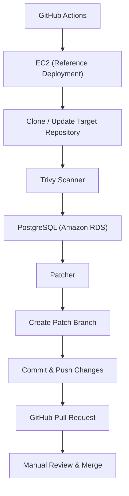

# CVE-Patcher

Automated dependency vulnerability remediation for GitHub repositories.

CVE-Patcher scans configured GitHub repositories for vulnerable dependencies, stores vulnerability findings and patch history in PostgreSQL, updates vulnerable packages, creates dedicated Git branches for security fixes, and pushes the generated changes to GitHub.

The project is designed to automate repetitive dependency remediation while keeping developers in control of reviewing and merging security fixes.[requirementsrequirements](https://github.com/mathivadhanis505/sample_repo/blob/auto-patch/CVE-23-Werkzeug/requirements.txt "requirements.txt")

CVE-Patcher is an educational open-source project maintained by the **Developers Club, IIITDM Kancheepuram**.

<p>
  
  
  
  
  
  
</p>

---

## Features

* Automated dependency vulnerability scanning
* Trivy-based filesystem scanning for known vulnerabilities
* Vulnerability finding and patch history storage in PostgreSQL
* Automatic dependency version updates
* Automatic Git branch creation for security patches
* Automatic commits and pushes of security fixes
* GitHub App-based authentication
* GitHub integration for repository and Pull Request operations
* Scheduled and manual GitHub Actions workflows
* Slack notifications for scan results and generated Pull Requests
* Configurable repository list through GitHub repository variables
* Manual maintainer review before merging security fixes

---

## Architecture



> [!IMPORTANT]
> The **EC2** and **Amazon RDS** components represent our reference deployment. CVE-Patcher itself is deployment-agnostic and can run on any Linux environment with Python, Git, Trivy, and PostgreSQL connectivity.

---

## Workflow

1. GitHub Actions starts the workflow on a schedule or through manual execution.
2. The workflow reads the target repositories from the `REPO_LIST` GitHub repository variable.
3. The reference deployment connects to the configured EC2 instance.
4. Each configured repository is cloned or updated locally.
5. Trivy scans the repository for known dependency vulnerabilities.
6. Vulnerability findings are stored in PostgreSQL.
7. The patcher determines the required dependency updates.
8. Vulnerable dependencies are updated in the target repository.
9. A dedicated Git branch is created for each patch.
10. The changes are committed and pushed to GitHub.
11. A GitHub Pull Request can then be opened for maintainer review.
12. The maintainer reviews and manually merges the security fix.

### Example

A deliberately vulnerable practice repository containing:

```text
Flask==2.0.0
Werkzeug==2.0.0
Jinja2==3.0.0
requests==2.19.1
urllib3==1.24.1
PyYAML==5.3.1
```

can be scanned by CVE-Patcher and produce vulnerability findings followed by automated dependency-update branches such as:

```text
auto-patch/CVE-20-Werkzeug
auto-patch/CVE-25-requests
auto-patch/CVE-11-Jinja2
```

The patcher commits the dependency changes and pushes the branches to the target GitHub repository.

> [!WARNING]
> Vulnerable dependency versions should only be used in isolated practice or testing repositories. Do not use intentionally vulnerable dependencies in production applications.

---

## Project Structure

```text
CVE-Patcher/
├── config/                 # Repository and scanner configuration
├── db/                     # Database models, schema, and CRUD operations
├── lambda/                 # Lambda entry point
├── notify/                 # Slack notification logic
├── patcher/                # Dependency patching and PR generation
├── scanner/                # Trivy integration and vulnerability parsing
├── .github/workflows/      # GitHub Actions workflows
├── requirements.txt
└── test_crud.py
```

---

## Tech Stack

| Technology      | Purpose                                 |
| --------------- | --------------------------------------- |
| Python          | Core application logic                  |
| GitHub Actions  | Workflow orchestration                  |
| Trivy           | Dependency vulnerability scanning       |
| PostgreSQL      | Vulnerability and patch history storage |
| SQLAlchemy      | Database ORM                            |
| Git             | Repository and patch branch management  |
| GitHub App      | Authentication and GitHub integration   |
| GitHub REST API | Repository and Pull Request operations  |
| Slack Webhooks  | Notifications                           |
| Amazon EC2      | Reference compute environment           |
| Amazon RDS      | Reference PostgreSQL deployment         |

---

## Installation

> [!NOTE]
> CVE-Patcher does not include deployment credentials or cloud infrastructure. You must configure your own GitHub credentials, repository variables, secrets, and deployment environment before running the workflows.

```bash
git clone git@github.com:DevClubIIITDM/cve_patcher.git
cd cve_patcher

python3 -m venv venv
source venv/bin/activate

pip install -r requirements.txt
```

CVE-Patcher also requires:

* Python 3.10+
* Git
* Trivy
* PostgreSQL connectivity

---

## Configuration

CVE-Patcher uses GitHub repository variables and secrets for configuration.

| Name            | Type                | Description                                                             |
| --------------- | ------------------- | ----------------------------------------------------------------------- |
| `REPO_LIST`     | Repository Variable | JSON array containing repositories to scan                              |
| `GH_PAT`        | Repository Secret   | GitHub Personal Access Token, where required by the configured workflow |
| `POSTGRES_URL`  | Repository Secret   | PostgreSQL connection string                                            |
| `SLACK_WEBHOOK` | Repository Secret   | Slack Incoming Webhook URL                                              |
| `EC2_HOST`      | Repository Secret   | Public IP address or hostname of the reference EC2 instance             |
| `EC2_SSH_KEY`   | Repository Secret   | Private SSH key used by GitHub Actions                                  |

### Example `REPO_LIST`

```json
[
  "owner/project-a",
  "owner/project-b"
]
```

> [!TIP]
> Store sensitive credentials using **GitHub Secrets** and configure `REPO_LIST` as a **GitHub Repository Variable**.

> [!IMPORTANT]
> The included GitHub Actions workflows require the appropriate secrets and variables to be configured before execution.

---

## Usage

CVE-Patcher is primarily designed to run through the provided GitHub Actions workflows.

### Manual Scan

1. Open the CVE-Patcher repository on GitHub.
2. Navigate to **Actions**.
3. Select the vulnerability scanning workflow.
4. Click **Run workflow**.
5. The workflow connects to the configured deployment environment and processes the repositories listed in `REPO_LIST`.

### Scheduled Scans

The workflow can also be configured to run automatically on a schedule, allowing repositories to be periodically checked for newly disclosed dependency vulnerabilities.

---

## Database

CVE-Patcher uses PostgreSQL to maintain information about vulnerability scans and patch attempts.

The database tracks information such as:

* Vulnerability findings
* Patch attempts
* Scan runs
* Run status and logs
* Patch history

This allows CVE-Patcher to maintain a record of remediation activity instead of treating every scan as an isolated operation.

---

## Security

CVE-Patcher is designed to automate dependency remediation without automatically merging security changes.

The system:

* Detects known dependency vulnerabilities
* Generates dependency updates
* Creates isolated patch branches
* Commits and pushes security fixes
* Supports Pull Request-based review

Maintainers remain responsible for reviewing and merging generated changes.

> [!IMPORTANT]
> Never commit GitHub tokens, database credentials, SSH private keys, Slack webhooks, GitHub App private keys, or other secrets to the repository.

---

## Deployment

CVE-Patcher is deployment-agnostic and can run anywhere the required dependencies are available.

Potential deployment environments include:

* Local Linux environments
* Self-hosted servers
* Cloud virtual machines
* Docker-based deployments

> [!NOTE]
> The current reference deployment uses:

```text
GitHub Actions
      ↓
Amazon EC2
      ↓
Amazon RDS (PostgreSQL)
```

These services are implementation choices for the reference deployment and are **not required** to use CVE-Patcher.

---

## Future Scope

Potential improvements include:

* Support for additional package managers such as npm, Maven, and Go modules
* Docker-based deployment and containerized execution
* Smarter dependency version resolution
* Improved handling of multiple CVEs affecting the same dependency
* Patch grouping to avoid redundant updates for the same package
* Dependency conflict detection and resolution
* Retry and rollback mechanisms for failed patch attempts
* Expanded integration and end-to-end testing
* Multi-scanner support such as OSV and Grype
* Improved Pull Request automation and metadata
* Web dashboard for vulnerability and remediation tracking
* Richer Slack reporting and notifications
* Support for larger repository sets and parallel scanning

---

## Contributing

Contributions are welcome.

Please read [`CONTRIBUTING.md`](CONTRIBUTING.md) before opening an Issue or Pull Request.

---

## License

This project is licensed under the **MIT License**.

See the [`LICENSE`](LICENSE) file for details.
