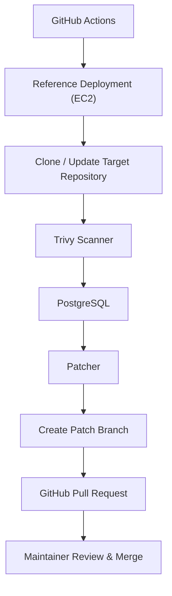

# AutoPatcher

**Automated dependency vulnerability remediation for GitHub repositories.**

AutoPatcher scans GitHub repositories for vulnerable dependencies, stores findings in PostgreSQL, updates vulnerable packages to secure versions, and opens GitHub Pull Requests for maintainers to review. It helps automate dependency security while keeping developers in control of the final merge.

Built by the **IIITDM Developer Club**.

<p>
  
  
  
  
  
</p>

---

## Features

- Automated dependency vulnerability scanning
- Trivy-based filesystem scanning for known CVEs
- PostgreSQL storage for vulnerability history and tracking
- Automatic dependency version bumping
- Automatic Git branch creation
- Automatic GitHub Pull Request creation
- GitHub Actions workflow for scheduled or manual execution
- Slack notifications for scan summaries

---

## Architecture



> [!IMPORTANT]
> AutoPatcher is deployment-agnostic. The GitHub Actions → Amazon EC2 → PostgreSQL (Amazon RDS) pipeline shown above is our reference deployment and is not required.

---

## Workflow

1. GitHub Actions starts the workflow on a schedule or through manual execution.
2. The workflow reads repositories from the `REPO_LIST` GitHub Actions variable.
3. The deployment environment clones or updates each configured repository.
4. Trivy scans the repository for vulnerable dependencies.
5. Vulnerability findings are stored in PostgreSQL.
6. The patcher updates vulnerable dependency versions.
7. A new Git branch is created.
8. A Pull Request is opened automatically.
9. Slack notifications summarize the scan.
10. A maintainer reviews and manually merges the Pull Request.

---

## Project Structure

```text
AutoPatcher/
├── .github/workflows/      # GitHub Actions workflows
├── config/                 # Repository and scanner configuration
├── db/                     # Database models, schema and CRUD operations
├── lambda/                 # Lambda entry point
├── notify/                 # Slack notification logic
├── patcher/                # Dependency patching and PR generation
├── scanner/                # Trivy integration and vulnerability parsing
├── requirements.txt
└── README.md
```

| Directory | Purpose |
|-----------|---------|
| `scanner/` | Runs Trivy scans and extracts vulnerability information |
| `patcher/` | Updates dependency versions, creates branches, and opens Pull Requests |
| `db/` | Stores vulnerabilities and patch history |
| `notify/` | Sends Slack notifications |
| `config/` | Repository and scanner configuration |
| `.github/workflows/` | GitHub Actions workflow definitions |

---

## Tech Stack

| Technology | Purpose |
|-----------|---------|
| Python | Core application logic |
| GitHub Actions | Workflow orchestration |
| Trivy | Dependency vulnerability scanning |
| PostgreSQL | Vulnerability storage |
| SQLAlchemy | Database ORM |
| GitHub REST API | Branch and Pull Request creation |
| Slack Webhooks | Notifications |

---

## Installation

```bash
git clone https://github.com/DevClubIIITDM/devops-project.git
cd devops-project

python3 -m venv venv
source venv/bin/activate

pip install -r requirements.txt
```

---

## Configuration

Each deployment should use its own GitHub repository, database and infrastructure.

Create the required GitHub Actions Secrets and Repository Variables before running the workflow.

### Required GitHub Secrets

| Secret | Description |
|---------|-------------|
| `GH_PAT` | GitHub Personal Access Token |
| `POSTGRES_URL` | PostgreSQL connection string |
| `SLACK_WEBHOOK` | Slack Incoming Webhook URL |
| `EC2_HOST` | Public IP or hostname of the deployment server |
| `EC2_SSH_KEY` | Private SSH key used by GitHub Actions |

### Required GitHub Repository Variables

| Variable | Description |
|----------|-------------|
| `REPO_LIST` | JSON array containing repositories to scan |

Example:

```json
[
  "owner/project-a",
  "owner/project-b"
]
```

---

## Usage

Run AutoPatcher through the GitHub Actions workflow.

1. Open **Actions**
2. Select **Nightly vulnerability scan**
3. Click **Run workflow**

> [!IMPORTANT]
> AutoPatcher creates Pull Requests automatically but **never merges them**.

---

## Deployment

AutoPatcher can run on any Linux environment with:

- Python
- Git
- Trivy
- PostgreSQL connectivity

Possible deployment targets include:

- Local Linux machines
- Self-hosted servers
- Cloud virtual machines
- Docker environments

Our reference deployment uses GitHub Actions, Amazon EC2 and PostgreSQL (Amazon RDS).

---

## Future Scope

Potential improvements include:

- Support for additional package managers
- Docker-based deployment
- GitHub App authentication
- Web dashboard for vulnerability tracking
- CVSS-based prioritization
- Smarter dependency version resolution
- Automatic changelog generation
- Retry and rollback mechanisms
- Expanded integration testing
- Multi-scanner support (OSV, Grype, etc.)
- Richer Slack reporting

---

## Contributing

Contributions are welcome.

1. Fork the repository.
2. Create a feature branch.
3. Commit your changes.
4. Submit a Pull Request.

Please discuss major feature proposals before implementation.

---

## License

This project is licensed under the **MIT License**.

See the [LICENSE](LICENSE) file for details.
