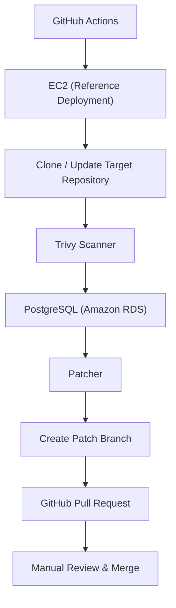

AutoPatcher
Automated dependency vulnerability remediation for GitHub repositories.
AutoPatcher scans GitHub repositories for vulnerable dependencies, stores vulnerability findings in PostgreSQL, updates vulnerable packages, and automatically opens GitHub Pull Requests for maintainers to review. It helps automate dependency remediation while keeping developers in control of the final merge.
AutoPatcher is an educational open-source project maintained by the Developer Club, IIITDM Kancheepuram.
<p>
  
  
  
  
  
</p>
---
Features
Automated dependency vulnerability scanning
Trivy-based filesystem scanning for known vulnerabilities
Stores vulnerability findings and patch history in PostgreSQL
Automatic dependency version updates
Automatic Git branch creation
Automatic GitHub Pull Request creation
Scheduled and manual GitHub Actions workflows
Slack notifications for scan results and generated pull requests
---
Architecture

> [!IMPORTANT]
> The **EC2** and **Amazon RDS** components represent our reference deployment. AutoPatcher itself is deployment-agnostic and can run on any Linux environment with Python, Git, Trivy, and PostgreSQL connectivity.
---
Workflow
GitHub Actions starts the workflow on a schedule or through manual execution.
The workflow reads the target repositories from the `REPO_LIST` GitHub repository variable.
The reference deployment connects to the configured EC2 instance.
Each configured repository is cloned or updated locally.
Trivy scans the repository for vulnerable dependencies.
Vulnerability findings are stored in PostgreSQL.
The patcher updates vulnerable dependency versions.
A new Git branch is created for each patch.
A GitHub Pull Request is opened.
A maintainer reviews and manually merges the Pull Request.
---
Project Structure
```text
AutoPatcher/
├── config/                 # Repository and scanner configuration
├── db/                     # Database models, schema, and CRUD operations
├── lambda/                 # Lambda entry point
├── notify/                 # Slack notification logic
├── patcher/                # Dependency patching and PR generation
├── scanner/                # Trivy integration and vulnerability parsing
├── .github/workflows/      # GitHub Actions workflows
├── requirements.txt
└── test_crud.py
```
---
Tech Stack
Technology	Purpose
Python	Core application logic
GitHub Actions	Workflow orchestration
Trivy	Dependency vulnerability scanning
PostgreSQL	Vulnerability storage
SQLAlchemy	Database ORM
GitHub REST API	Branch and Pull Request creation
Slack Webhooks	Notifications
Amazon EC2	Reference deployment
Amazon RDS	Reference PostgreSQL deployment
---
Installation
> [!NOTE]
> AutoPatcher does not include deployment credentials or cloud infrastructure. Before running the workflows, you must configure your own GitHub Secrets, repository variables, and deployment environment.
```bash
git clone git@github.com:DevClubIIITDM/cve_patcher.git
cd cve_patcher

python3 -m venv venv
source venv/bin/activate

pip install -r requirements.txt
```
---
Configuration
AutoPatcher uses GitHub repository variables and secrets for configuration.
Name	Type	Description
`REPO_LIST`	Repository Variable	JSON array of repositories to scan
`GH_PAT`	Repository Secret	GitHub Personal Access Token
`POSTGRES_URL`	Repository Secret	PostgreSQL connection string
`SLACK_WEBHOOK`	Repository Secret	Slack Incoming Webhook URL
`EC2_HOST`	Repository Secret	Public IP address or hostname of the reference EC2 instance
`EC2_SSH_KEY`	Repository Secret	Private SSH key used by GitHub Actions
Example `REPO_LIST`:
```json
[
  "owner/project-a"
]
```
> [!TIP]
> Store sensitive values using **GitHub Secrets** and configure `REPO_LIST` as a **GitHub Repository Variable**.
> [!IMPORTANT]
> The included GitHub Actions workflows require these secrets and variables to be configured before execution.
---
Usage
AutoPatcher is designed to run through the provided GitHub Actions workflows.
To start a scan manually:
Open the repository on GitHub.
Navigate to Actions.
Select Nightly vulnerability scan.
Click Run workflow.
---
Security
AutoPatcher automates dependency remediation by creating GitHub Pull Requests.
All generated pull requests require manual review before merging. AutoPatcher does not merge pull requests automatically.
---
Deployment
AutoPatcher is deployment-agnostic and can run anywhere Python, Git, Trivy, and PostgreSQL connectivity are available.
Supported deployment options include:
Local Linux environments
Self-hosted servers
Cloud virtual machines
Docker-based deployments
> [!NOTE]
> The reference deployment uses **GitHub Actions → Amazon EC2 → Amazon RDS (PostgreSQL)**. These services are implementation choices and are not required to use AutoPatcher.
---
Future Scope
Potential improvements include:
Support for additional package managers
Docker-based deployment
GitHub App authentication
Web dashboard for vulnerability tracking
Smarter dependency version resolution
Retry and rollback mechanisms
Expanded integration testing
Multi-scanner support (OSV, Grype, etc.)
Richer Slack reporting
---
Contributing
Contributions are welcome.
Please read CONTRIBUTING.md before opening an Issue or Pull Request.
---
License
This project is licensed under the MIT License.
See the LICENSE file for details.